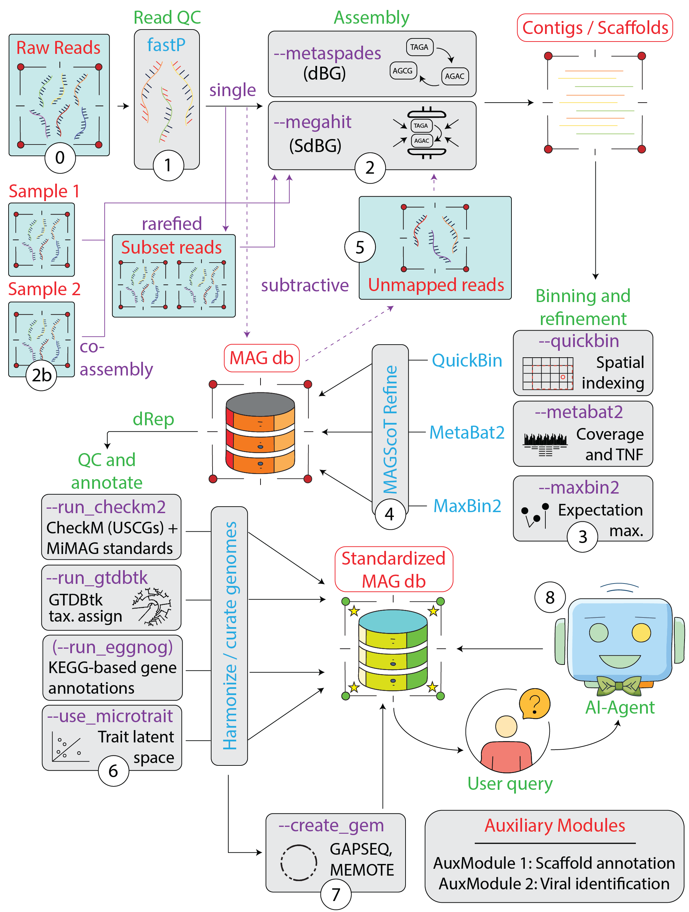

SAMWISE is a semi-automated, end-to-end metagenomic read processing program
implemented as a collection of [Nextflow](https://www.nextflow.io/) DSL2
workflows.

The workflows support read validation and trimming, assembly, binning, bin
refinement, MAG annotation, metabolic-model generation, and selected auxiliary
analyses. SAMWISE can be run without the optional AI agent.

## Choose a path

- [Install the prerequisites](getting-started/requirements.md) before running a
  workflow.
- Follow the [quick start](getting-started/quick-start.md) for a representative
  end-to-end run.
- Review [input preparation](getting-started/inputs.md) before supplying reads.
- Use the [workflow reference](workflows/module-0-read-processing.md) for
  module-specific behavior and options.
- Read about the optional [AI agent](agent.md) separately before configuring
  credentials.

## Source and license

The source repository is available at
[PNNL-SoilSFA/samwise](https://github.com/PNNL-SoilSFA/samwise). See the
repository's `LICENSE.md` for licensing and government disclaimer terms.

The documentation is being reorganized from the root `README.md`. During this
transition, the README remains the most complete reference for every workflow
parameter.
